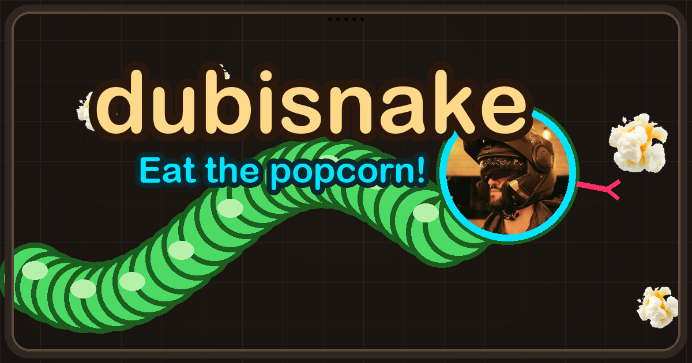
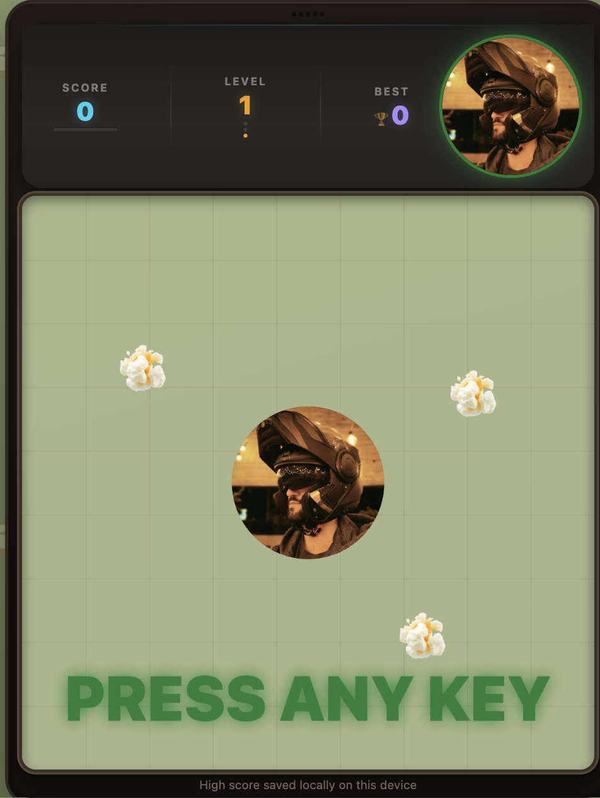
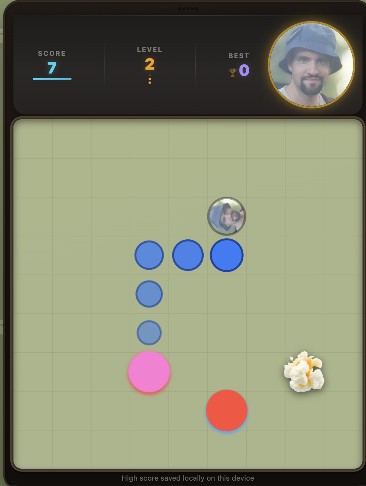
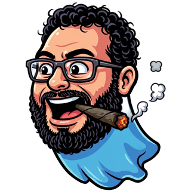
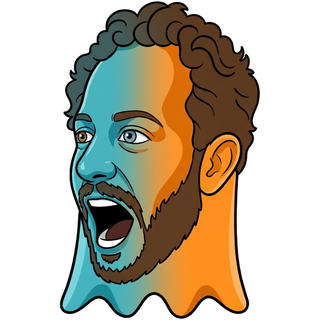
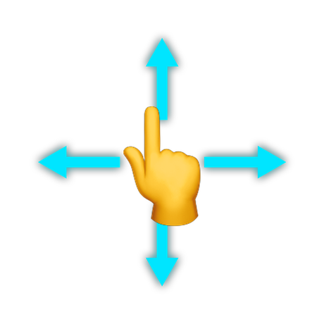
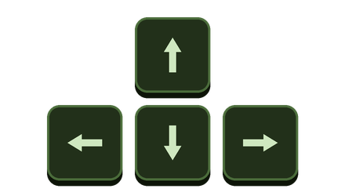

<div align="center">



### [ click the popcorn to play ](https://roei88.github.io/dubisnake/)

### ⬇️ &nbsp;&nbsp; ⬇️ &nbsp;&nbsp; ⬇️

<a href="https://roei88.github.io/dubisnake/"></a>

### ⬆️ &nbsp;&nbsp; ⬆️ &nbsp;&nbsp; ⬆️

&nbsp;


&nbsp;&nbsp;


</div>

### 📖 The Legend

Long ago, in the flickering green glow of an old brick phone, a hero was
swallowed whole by the screen. He woke up long, scaly, and very, very hungry.

That hero is **DubiSnake** - named after **Oren Dubinsky**, the real person
whose face you see on the snake's head.

There is only one way out: eat every last piece of **popcorn** on the board and
survive all three levels.

### 👹 Meet the Monsters

<div align="center">


### TheLabbovichi

The original stalker. Always on the board, always right behind you.

&nbsp;



### GrosZBaker

A baker who set out to "bake a cake," fumbled the recipe *and* the spelling, and
has been cross about it ever since.

&nbsp;



### Enshula

The final terror. You only meet Enshula once you have earned it, and you will
wish you hadn't.

</div>

### 🎮 How to Play

The goal is simple: **eat the popcorn, dodge everything else.** Every 5 pieces
clears the level. Clear all three and you win the crown 👑.

#### 📱 On mobile

<div align="center">

</div>

- **Swipe** in any direction to steer
- Turn mid-move - keep your finger down and swipe again
- **Tap the board** to start or restart
- A one-time hint pops up the first time you play

#### 💻 On desktop

<div align="center">

</div>

- **Arrow keys** to steer
- **Enter** to start or restart
- **Space** to pause and resume
- The board stays centered and crisp at any window size

### 🛠️ For Developers

DubiSnake ships as **one self-contained `index.html`** - vanilla JavaScript and
an HTML5 canvas, **zero dependencies**, no CDNs. A locked Content-Security-Policy
means the same file runs on GitHub Pages or straight from `file://`, offline.

The single file is **generated** - do not edit `index.html` by hand. The source
lives split by concern under `src/`, assembled by a tiny zero-dependency Node
script:

```
src/
  index.template.html   page shell: <!--INCLUDE:html/...--> partials plus
                        /*BUILD:STYLES*/ and /*BUILD:SCRIPT*/ markers
  html/                 markup partials spliced in at their INCLUDE marker
    hud.html              score header
    board.html            board, canvas, level banner, overlay
    mobile-help.html      first-visit swipe popup
  css/                  CSS, concatenated in cascade order (see build.mjs):
    base / frame / hud / board / overlay / tutorial / buttons /
    level-banner / footer / lang-toggle / mobile-help .css
  js/                   the game, concatenated in load order (see build.mjs):
    _open.js              IIFE open
    constants.js          grid/speed/colour constants, DOM refs
    strings.js            i18n strings (he/en) + I18n class
    assets.js             AssetStore class, head cycle / level tint
    chasers.js            ChaserField class (Pac-Man-style monster field)
    layout.js             responsive board sizing
    core.js               game state, level flow, win/endless mode, input, step()
    overlays.js           menu / dead / won / GAME WON / paused / banner
    animations/           one file per animation:
      ghost-idle.js         ghost float/rotate/pulse/glow
      opener.js             opening intro scene + PRESS ANY KEY
      countdown.js          get-ready countdown number
    render.js             canvas rendering + fixed-timestep loop
    _boot.js              keyboard/touch/UI handlers, boot, IIFE close
build.mjs                zero-dependency build (Node, no npm packages)
assets/                  the sprites the game draws from (heads, popcorn, monsters)
```

#### Building

```
node build.mjs
```

This inlines every `src/css/*.css` and `src/js/*.js` file (in the order declared
in `build.mjs`) into `index.html`. There is nothing to install. Edit files under
`src/`, run the build, then commit both the sources and the regenerated
`index.html`.
